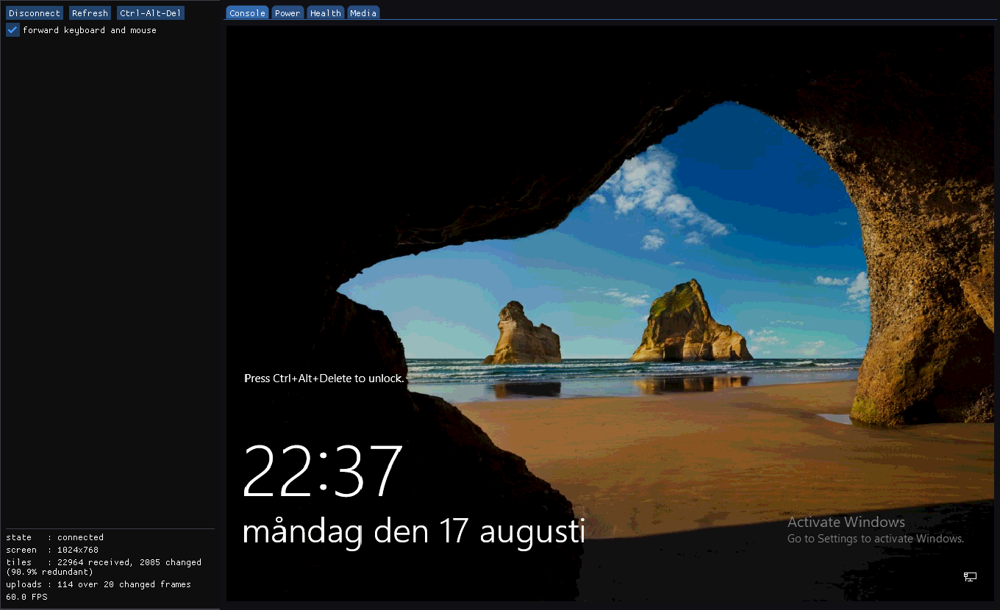

# ilo2ctl — an iLO 2 control tool in C++

Drive an HP iLO 2 (e.g. a ProLiant DL380 G6) without Java, a browser, or HP's
applet: remote console with keyboard and mouse, server power and UID, health
readout, and serving an ISO for virtual media. One static binary, no OpenSSL,
no external dependencies.



*Decoding a real iLO 2's video. This particular frame is rendered from a
capture fixture in `testdata/`, so it reproduces without any hardware —
`ilo2ctl --replay testdata/lock_screen_settled.bin` shows exactly this.*

It began as a from-scratch reimplementation of the remote-console applet
(`com.hp.ilo2.remcons`, shipped as `rc175p10.jar`) — decoding its video and
sending input — and grew past the console into the rest of what an iLO 2 can be
told to do over RIBCL, which is where the name comes from.

The applet is **not obfuscated**, so each class was decompiled (CFR) and ported
class-by-class, with every component validated **byte-for-byte against HP's real
bytecode** via small Java oracles (reflection / recording subclasses).

Those recordings are frozen in `tests/oracle/`, so the whole suite asserts
against HP's observed behaviour with **no jar, no Java and no network** — see
`tests/oracle/README.md`. HP's `rc175p10.jar` is proprietary: it is not in this
repository, has never been committed to it, and nothing here needs it.

## Layout

| Path | Role | Validated against |
|---|---|---|
| `crypto/md5.hpp` | MD5 | RFC 1321 vectors + Java `VMD5` |
| `crypto/rc4.hpp` | RC4 (KSA/PRGA standard; MD5 key derivation is HP's) | Java `RC4` keystream |
| `crypto/sha1.hpp` | SHA-1 | FIPS 180 vectors via Python `hashlib` |
| `crypto/hmac.hpp` | HMAC, templated over either hash | RFC 2202 vectors via Python `hmac` |
| `crypto/bigint.hpp` | fixed-width bignum; `m^e mod n` for public `e` | Python `pow(m, e, n)` |
| `crypto/rsa.hpp` | RSA PKCS#1 v1.5 type-2 encryption | structural + composition tests |
| `crypto/random.hpp` | CSPRNG (`BCryptGenRandom` / `getrandom`) | distribution smoke test |
| `tls/der.hpp` | X.509 -> RSA public key (no verification) | the real iLO certificate |
| `tls/prf.hpp` | TLS 1.0 PRF + master/key-block/Finished | OpenSSL `TLS1-PRF` (MD5-SHA1) |
| `tls/record.hpp` | record layer, RC4 + HMAC, continuous keystream | independent Python model |
| `tls/handshake.hpp` | messages, transcript, Finished | simulated handshake |
| `tls/client.hpp` | handshake state machine + `https_get` | scripted mock server |
| `tls/socket.hpp` | blocking TCP client, Windows + POSIX | — |
| `ilo/ilo_session.hpp` | iLO login + drc2fram.htm parameter scrape | live iLO 2 |
| `tools/tls_get.cpp` | HTTPS fetch (replaces `curl --tlsv1.0`) | byte-identical to curl |
| `ui/console_core.hpp` | front-end seam: framebuffer, dirty rects, input | replay fixtures + live |
| `ui/sdl_main.cpp` | the standalone console window (SDL3 + Dear ImGui) | live iLO 2 |
| `ui/power_control.hpp` | RIBCL worker behind the panel's power buttons | live iLO 2 |
| `ui/connections.hpp` | recent host/user list (never the password) | `test_connections` |
| `ilo/ribcl.hpp` | RIBCL over raw TLS: power, UID, health, virtual media, boot order | live iLO 2 (fw 2.29) |
| `ilo/health.hpp` | GET_EMBEDDED_HEALTH / GET_POWER_READINGS parser | `testdata/*.xml` captured from the iLO |
| `tools/ilo_power.cpp` | RIBCL from the command line | live iLO 2 |
| `tools/console_probe.cpp` | drives the seam like a front end would | live iLO 2 |
| `ilo/telnet.hpp` | transport: socket, login, DVC trigger, decrypt | real `telnet.run()` |
| `ilo/dvc_bits.hpp` | DVC bit reader (reversal tables, get/add_bits) | real `cim` reflection |
| `ilo/dvc_cache.hpp` | RGB444 remap + LRU palette cache | real `cim` reflection |
| `ilo/dvc_decoder.hpp` | the 48-state DVC video FSM | deterministic equivalence vs `cim` |
| `ilo/cim_png.hpp` | framebuffer -> PNG (vendored `stb_image_write`) | Java `ImageIO` |
| `ilo/ilo2_input.hpp` | outbound mouse/keyboard encoders | real `cim` (transmit capture) |
| `ilo/ilo2_session.hpp` | outbound session layer (RC4 encrypt, key index) | live iLO 2 |
| `ilo/media_server.hpp` | serves an ISO over HTTP, ranges included | `test_media` + live iLO 2 |
| `ui/media_control.hpp` | virtual-media worker behind the (future) Media tab | live iLO 2 (fw 2.29) |
| `tools/media_server.cpp` | the server as a standalone command | live iLO 2 (fw 2.29) |
| `tools/capture_dvc.cpp` | live capture -> `.bin` + PNG | — |
| `tools/replay_dvc.cpp` | offline replay + decoder stats | `testdata/` fixtures |
| `tests/oracle/` | frozen recordings of HP's bytecode (the expected values) | — |
| `tests/test_*.cpp` | the suite; every test self-asserting | `tests/oracle/` + generated vectors |
| `tests/*Probe.java` | how those recordings were made; needs a jar you supply | — |

Local includes are root-relative (`#include "crypto/md5.hpp"`), so the source
root is the only include directory required.

## Building

```
cmake -S . -B build/cmake -G Ninja -DCMAKE_BUILD_TYPE=Release
cmake --build build/cmake
cd build/cmake && ctest --output-on-failure
```

Builds on Windows (MinGW) and Linux. The Linux side is checked in a container,
which needs nothing but a compiler:

```
docker run --rm -v "$PWD:/src:ro" debian:stable-slim sh -c   'apt-get -qq update && apt-get -qq install -y --no-install-recommends      build-essential cmake ninja-build && cp -a /src /work && cd /work &&    cmake -S . -B b -G Ninja -DCMAKE_BUILD_TYPE=Release && cmake --build b &&    cd b && ctest --output-on-failure'
```

(The copy is because CTest runs from the source root and a few tests write
scratch into `build/`, which a read-only mount will not allow.)

One warning is expected there and is not a defect: GCC 14 emits
`-Wfree-nonheap-object` for a plain `std::vector` copy in `tests/test_der.cpp`,
but only at `-O3` — it is clean at `-O0`, `-O1` and `-O2`, which is not how a
real invalid free behaves.

Building the GUI on Linux needs SDL3's own dependencies. This set works on
Debian 13; it has not been minimised:

```
build-essential cmake ninja-build git ca-certificates pkg-config
libx11-dev libxext-dev libxrandr-dev libxcursor-dev libxi-dev libxfixes-dev
libxss-dev libxtst-dev libxinerama-dev libxkbcommon-dev libwayland-dev
wayland-protocols libdecor-0-dev libgl1-mesa-dev libegl1-mesa-dev
libasound2-dev libdbus-1-dev libudev-dev
```

Two of those are easy to trip over. SDL3 **refuses to configure** with no X11
or Wayland development libraries at all, even for a headless build where only
the dummy video driver is wanted, and it separately insists on XTEST
(`libxtst-dev`) once X11 is found. Neither is needed to *run* headless — only
to build.

The GUI is off by default so a bare clone builds and tests with no network:

```
cmake -S . -B build/gui -G Ninja -DCMAKE_BUILD_TYPE=Release -DILO2_BUILD_GUI=ON
cmake --build build/gui --target ilo2ctl
build/gui/ilo2ctl --host 192.0.2.10
```

That clones pinned SDL3 (`release-3.4.14`) and Dear ImGui (`v1.92.9`) and links
them statically, so the result is a single binary that does not depend on what
a distro happens to ship. `--replay <file.bin>` runs it against a capture
fixture with no hardware, `--tab power|health` picks the starting tab, and `--screenshot out.png --frames N` renders N frames
and exits, which works under `SDL_VIDEO_DRIVER=dummy` for checking the front end
without a window.

- No Java is required. The oracles that recorded `tests/oracle/` needed JDK 17
  and HP's jar; re-running them is optional and documented in
  `tests/oracle/README.md`.
- Vendored, no fetch: `third_party/stb_image_write.h` (PNG encode) and
  `third_party/httplib.h` (cpp-httplib 0.54.1, MIT, for `media_server`). On
  Windows `media_server` needs `_WIN32_WINNT=0x0A00` and a static
  libstdc++/libgcc/winpthread — CMake sets both; see the comment there for what
  breaks without them.
- stb: exactly one TU defines `STB_IMAGE_WRITE_IMPLEMENTATION` before including
  `third_party/stb_image_write.h`.
- Reference vectors are generated, not transcribed:
  `python tests/gen_hash_vectors.py > tests/hash_vectors.inc` and
  `python tests/gen_bigint_vectors.py > tests/bigint_vectors.inc`.

## Not tracked (see `.gitignore`)

`build/` is generated. `rc175p10.jar` and anything derived from it are excluded
on purpose — see [Provenance and scope](#provenance-and-scope) below.

## Licence

Apache License 2.0 — see [`LICENSE`](LICENSE). Copyright 2026 Centlake Software AB.

Third-party code included in this repository, under its own terms:

| | | |
|---|---|---|
| `third_party/stb_image_write.h` | Sean Barrett | public domain (Unlicense) or MIT, at your option |
| `third_party/httplib.h` | cpp-httplib, Yuji Hirose | MIT |

Fetched at build time, only when `-DILO2_BUILD_GUI=ON`, and statically linked
into `ilo2ctl`: **SDL3** (zlib licence) and **Dear ImGui** (MIT). Neither is
vendored here; both are pinned by tag in `CMakeLists.txt`.

## Provenance and scope

This is a clean reimplementation, and it matters for anyone forking it that the
boundary is precise:

- **No HP code is in this repository**, and none ever has been. `rc175p10.jar`
  is HP proprietary. It is not included, is not required to build, test or run
  anything here, and `.gitignore` refuses to commit it or the `_decomp/` and
  `_extract/` trees a decompiler produces from it. Obtain your own copy from an
  iLO 2 if you want to regenerate the fixtures below.
- **`tests/oracle/` holds recordings, not implementation.** They are observed
  outputs — table contents, encoder bytes, FSM state after each input byte —
  captured by running HP's classes under the probes in `tests/*Probe.java` and
  writing down what came out. The probes are original code that reflects into
  HP's classes by name; they contain no HP logic. See
  [`tests/oracle/README.md`](tests/oracle/README.md) for how each was produced.
- **`testdata/` is captured from the author's own hardware** — an iLO 2 on
  firmware 2.29. The DVC streams are post-decryption video of a lock screen, the
  XML is RIBCL replies, and the HTTP log is that firmware's own requests. None
  of it carries credentials, session tokens or image URLs;
  [`testdata/README.md`](testdata/README.md) says so per fixture and explains
  what each one is for.

The applet was not obfuscated, so the port was done by reading decompiled
sources and re-implementing behaviour, then checking that behaviour against the
real bytecode. Whether that is appropriate for your jurisdiction and purpose is
your call to make, not this file's.

## Status

Working end to end against a real iLO 2: TLS 1.0 login, session scrape,
DVC video, keyboard and mouse, plus server control over RIBCL (power, reset,
UID) and health readout (temperatures, fans, PSUs, drives, wattage). The
console window has three tabs — Console, Power, Health — over a status block.

No Python is left in the operational path — the last two scripts are gone, and
what remains is `tests/gen_*.py`, which generate reference vectors offline and
are never needed to build or run anything. Serving an image is
now `tools/media_server.cpp`, live-validated — the iLO 2 fetched a 4.7 GiB ISO
from it over 38 range requests with no errors
(`testdata/ilo2_vm_http_requests.log`, which also records the firmware's odd
20-digit zero-padded `Range` header). `mount_and_boot.py` went with it: it had
stopped working anyway (it needs the unavailable `hpilo` package and still
defaulted to a stale address), and the sequence it encoded is written down in
raw RIBCL, with its verified and unverified parts marked, under "The mount +
one-time-boot sequence" in `testdata/README.md`.

Builds and passes its tests on Linux as well as Windows: Debian 13 with GCC 14,
22/22, with `replay_dvc` and `media_server` exercised too — the latter is the
only thing that touches the POSIX listening-socket path. The GUI builds there
as well, with no warnings in this project's own code, and renders correctly
under `SDL_VIDEO_DRIVER=dummy` against a replay fixture. What has *not* happened
on Linux is a run against real hardware, or against a real display server.

The RIBCL side of virtual media is written too: `ribcl.hpp` now carries the
wrapper per command (`SERVER_INFO` vs `RIB_INFO`), takes arguments, and parses
`GET_VM_STATUS` and `GET_FW_VERSION`. `ilo_power` exposes the lot, so a mount
can be driven from the command line today:

```
ilo_power --host H fw                     # incl. whether the licence allows it
ilo_power --host H vm-status
ilo_power --host H vm-insert http://me:8080/x.iso
ilo_power --host H vm-boot BOOT_ONCE
ilo_power --host H set-one-time-boot CDROM
ilo_power --host H reset
```

`ui/media_control.hpp` is the worker behind all that, the sibling of
`power_control.hpp`: it owns the HTTP server and the RIBCL calls, and works out
the URL to advertise by asking the kernel which local address reaches the iLO
rather than guessing from the interface list — which matters, since the iLO is
usually on a different subnet. Mounting and arming a boot are separate calls, so
mounting can never change what the next reboot does.

Open: `LocaleTranslator` is unported, so non-US layouts only send ASCII. Virtual
media has no ISO picker or Media tab yet, so the GUI cannot mount anything —
the command line above is the whole interface. And the two steps that arm a
boot, `vm-boot BOOT_ONCE` and `set-one-time-boot CDROM`, have never been sent to
hardware: see the verified/unverified split in `testdata/README.md`.
